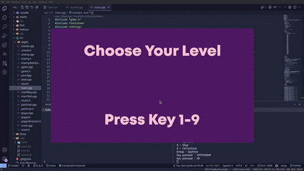
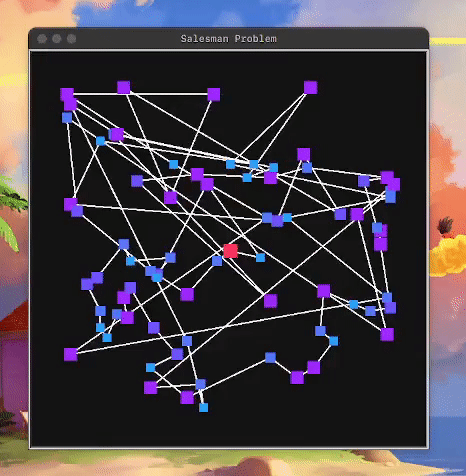

# Bienvenue sur mon Profil
## Me retrouver

- 📫 Contactez-moi sur **jules.ginhac@etu.univ-lyon1.fr**

## Quelques statatistiques

## Mes projets 

### Miso Mania 
Projet réalisé dans le cadre de l'UE LIFAP4 à l'Université Claude Bernard Lyon 1, dans le cadre de ma deuxième année de préparation aux écoles d'ingénieurs Polytech (Peip). 
Miso Mania est un jeu de plateforme en 2D. Ce jeu se situe à la croisée des chemins, entre le jeu de plateforme et le die and retry. Le joueur contrôle un personnage qui doit atteindre la fin du niveau. Le jeu dispose d'un éditeur de niveau, d'un système de partage de niveau et d'un tableau de classement. 
Miso Mania permet au joueur de créer un utilisateur dans le jeu, et cet utilisateur peut acheter des skins pour le personnage, ainsi que des particules. Les pièces sont gagnées en terminant les niveaux, et plus le joueur se rapproche du sommet du classement, plus il gagne de pièces. 
Le jeu est distribué sur WSL, Mac et Linux. Le jeu a été créé en utilisant la bibliothèque SDL2 et C++ par Romain Rochebloine, Mathieu Ponton et moi-même.
Pour ce projet, nous avons été classés 9 sur 211 avec une note de 18,42/20

  

### BDanse    
Projet réalisé dans le cadre de l'UE LIFABDW à l'Université Claude Bernard Lyon 1, dans le cadre de ma deuxième année de préparation aux écoles d'ingénieurs Polytech (Peip). Ce projet a été réalisé avec Mathieu Ponton. 
Ce projet est un site web, créé en utilisant l'architecture MVC, qui permet la gestion d'une école de danse. Il permet de gérer les élèves de l'école, les professeurs, les cours, les salles, etc. Il permet également la gestion d'une fédération de danse, avec la gestion des danseurs, des compétitions, des résultats, etc. 
Ce projet a été réalisé en utilisant PHP, HTML, CSS, JS et MySQL. 
Pour ce projet, nous avons été classés 9 sur 59 groupes, avec une note de 16,25/20.

  

### Optimisation de tournées de véhicules 
Projet réalisé dans le cadre de mes études à Polytech Lyon, avec Maxime Antoine, Mathieu Ponton et Pablo Verchère. 
Le but du projet était de développer un programme python pour trouver le plus court chemin entre 100 points sur une carte. Ce projet est une version du problème du voyageur de commerce (“Travelling Salesman Problem” en anglais). Le programme permet à l'utilisateur de choisir un ou plusieurs camions pour livrer un nombre de points prédéfinis. 
Le programme a été développé à l'aide de la bibliothèque python Turtle, et les algorithmes utilisés sont l'algorithme du plus proche voisin pour la solution initiale, 2-opt, relocate et swap pour la recherche locale. Tous les algorithmes ont été développés par nos soins. 
Le programme a une interface graphique qui montre en temps réel le meilleur chemin. Toutes les données ont été enregistrées dans des fichiers .xlsx pour nous permettre d'analyser les résultats. 
Pour ce projet, nous avons été classés 1 sur 40 groupes, avec une note de 19/20.

  

## Languages et outils

## En apprentissage / perfectionnement

